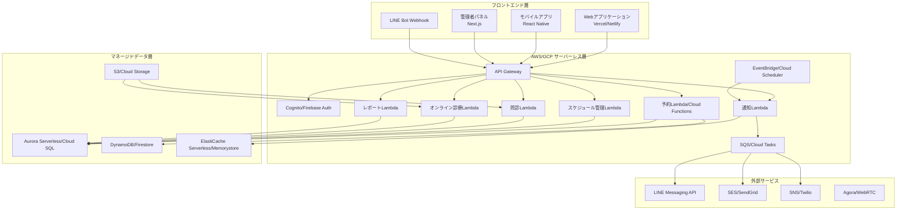
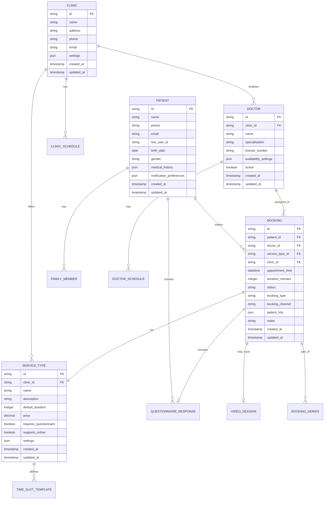
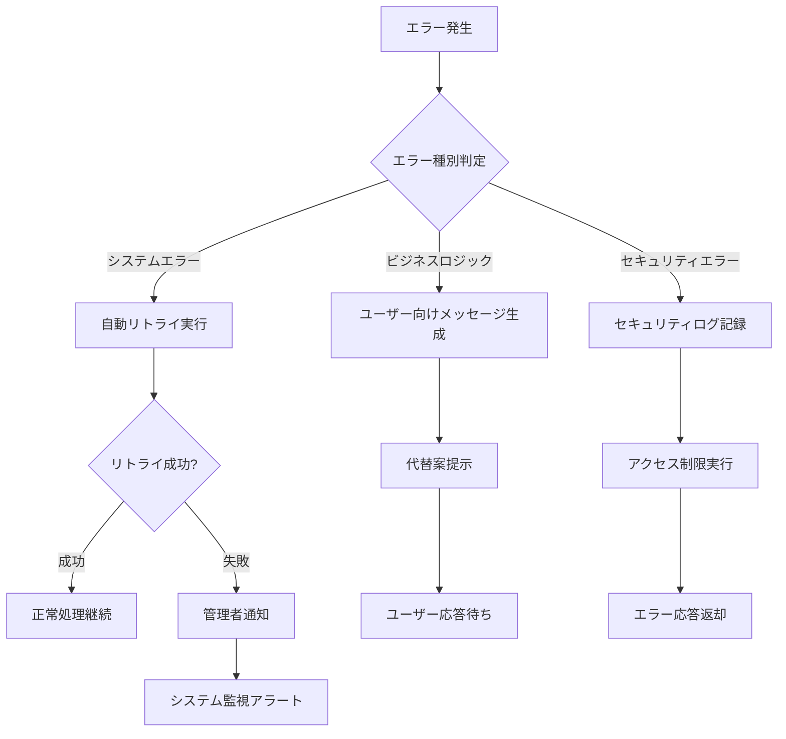

# 設計書

## 概要

クリニック予約システムは、患者の予約管理、スタッフの業務効率化、オンライン診療対応を統合した包括的な医療予約プラットフォームです。Web、LINE、モバイルアプリからのマルチチャネル予約に対応し、複雑なスケジュール管理と医療業務フローをサポートします。

## アーキテクチャ

### システム全体構成（サーバーレス）



### 技術スタック（サーバーレス）

- **フロントエンド**: React.js (Vercel), React Native (Mobile), Next.js (Vercel)
- **バックエンド**: AWS Lambda / Google Cloud Functions (Node.js/TypeScript)
- **API Gateway**: AWS API Gateway / Google Cloud Endpoints
- **認証**: AWS Cognito / Firebase Authentication
- **データベース**: Aurora Serverless (PostgreSQL) / Cloud SQL + Firestore
- **キャッシュ**: ElastiCache Serverless / Cloud Memorystore
- **ファイルストレージ**: AWS S3 / Google Cloud Storage
- **メッセージキュー**: AWS SQS / Google Cloud Tasks
- **スケジューラー**: AWS EventBridge / Google Cloud Scheduler
- **監視**: CloudWatch / Google Cloud Monitoring
- **デプロイ**: Serverless Framework / AWS SAM / Google Cloud Functions

## コンポーネントと インターフェース

### 1. 予約管理コンポーネント

**責任範囲:**
- 予約の作成、更新、キャンセル
- 予約枠の管理と可用性チェック
- 連続予約の処理
- 家族予約の管理

**主要インターフェース:**
```typescript
interface BookingService {
  createBooking(bookingData: BookingRequest): Promise<Booking>
  updateBooking(id: string, updates: BookingUpdate): Promise<Booking>
  cancelBooking(id: string, reason: string): Promise<void>
  getAvailableSlots(date: Date, serviceType: ServiceType): Promise<TimeSlot[]>
  createSeriesBooking(seriesData: SeriesBookingRequest): Promise<Booking[]>
  getFamilyBookings(familyId: string): Promise<Booking[]>
}
```

### 2. スケジュール管理コンポーネント

**責任範囲:**
- 医師・診療科目別スケジュール設定
- 営業時間・休日管理
- 予約枠の動的生成
- スケジュール競合の検出

**主要インターフェース:**
```typescript
interface ScheduleService {
  setDoctorSchedule(doctorId: string, schedule: DoctorSchedule): Promise<void>
  setClinicHours(clinicId: string, hours: ClinicHours): Promise<void>
  generateTimeSlots(date: Date, serviceType: ServiceType): Promise<TimeSlot[]>
  blockTimeSlot(slotId: string, reason: string): Promise<void>
  checkConflicts(schedule: ScheduleRequest): Promise<Conflict[]>
}
```

### 3. 通知管理コンポーネント

**責任範囲:**
- メール・SMS・LINE通知の統合管理
- 予約リマインダーの自動送信
- 通知テンプレート管理
- 配信履歴の追跡

**主要インターフェース:**
```typescript
interface NotificationService {
  sendBookingConfirmation(booking: Booking): Promise<void>
  sendReminder(booking: Booking, reminderType: ReminderType): Promise<void>
  sendCancellationNotice(booking: Booking): Promise<void>
  scheduleReminders(booking: Booking): Promise<void>
  updateNotificationPreferences(userId: string, preferences: NotificationPreferences): Promise<void>
}
```

### 4. 問診管理コンポーネント

**責任範囲:**
- 症状別問診フォームの動的生成
- 問診回答の検証と保存
- 医師向け問診結果の整理
- 問診履歴の管理
- QRコードによる電子カルテ連携

**主要インターフェース:**
```typescript
interface QuestionnaireService {
  getQuestionnaireBySymptom(symptom: string): Promise<Questionnaire>
  submitQuestionnaireResponse(response: QuestionnaireResponse): Promise<void>
  getPatientQuestionnaires(patientId: string): Promise<QuestionnaireResponse[]>
  analyzeUrgency(response: QuestionnaireResponse): Promise<UrgencyLevel>
  generateQRCode(questionnaireId: string): Promise<QRCodeData>
  syncWithEMRViaQR(qrCode: string): Promise<SyncResult>
}
```

### 5. オンライン診療コンポーネント

**責任範囲:**
- ビデオ通話セッションの管理
- 診療記録の作成・保存
- 処方箋発行機能
- セキュアな通信環境の提供

**主要インターフェース:**
```typescript
interface TelemedicineService {
  createVideoSession(bookingId: string): Promise<VideoSession>
  joinSession(sessionId: string, participantType: ParticipantType): Promise<SessionToken>
  recordConsultation(sessionId: string, record: ConsultationRecord): Promise<void>
  issuePrescription(consultationId: string, prescription: Prescription): Promise<void>
}
```

## データモデル

### 主要エンティティ



### データベース設計の考慮事項

1. **パーティショニング**: 予約データを日付でパーティション分割し、クエリパフォーマンスを向上
2. **インデックス戦略**: 予約検索の高速化のため、複合インデックスを適切に配置
3. **データ保持ポリシー**: 医療記録の法的保存期間に準拠したデータ保持戦略
4. **バックアップ戦略**: 医療データの重要性を考慮した冗長バックアップ

## エラーハンドリング

### エラー分類と対応

1. **ビジネスロジックエラー**
   - 予約重複エラー
   - スケジュール競合エラー
   - 予約期限切れエラー
   - 対応: ユーザーフレンドリーなエラーメッセージと代替案の提示

2. **システムエラー**
   - データベース接続エラー
   - 外部API連携エラー
   - サーバー過負荷エラー
   - 対応: 自動リトライ機構とフォールバック処理

3. **セキュリティエラー**
   - 認証失敗
   - 権限不足
   - 不正アクセス試行
   - 対応: セキュリティログの記録とアクセス制限

### エラー処理フロー



## テスト戦略

### テストレベル

1. **単体テスト**
   - 各サービスクラスの個別機能テスト
   - データモデルの検証テスト
   - ビジネスロジックの境界値テスト
   - カバレッジ目標: 90%以上

2. **統合テスト**
   - API エンドポイントのテスト
   - データベース連携テスト
   - 外部サービス連携テスト
   - LINE Bot機能のテスト

3. **E2Eテスト**
   - 予約フロー全体のテスト
   - 管理者操作フローのテスト
   - マルチデバイス対応テスト
   - パフォーマンステスト

### テスト自動化

- **CI/CD パイプライン**: GitHub Actions / GitLab CI
- **テストデータ管理**: Factory パターンでテストデータ生成
- **モックサービス**: 外部API依存の分離
- **負荷テスト**: JMeter / Artillery を使用した性能テスト

### テスト環境

- **開発環境**: 開発者個人の環境
- **ステージング環境**: 本番環境と同等の構成
- **テスト環境**: 自動テスト専用環境
- **本番環境**: 実際のサービス提供環境

## APIレート制限とスロットリング

### レート制限戦略

1. **エンドポイント別制限**
   - 予約作成: 1分間に10リクエスト/ユーザー
   - 予約検索: 1分間に30リクエスト/ユーザー
   - 管理API: 1分間に100リクエスト/管理者
   - LINE Webhook: 1秒間に10リクエスト

2. **実装方法**
   - API Gateway のスロットリング機能を使用
   - DynamoDB でトークンバケットアルゴリズムを実装
   - Lambda レイヤーで共通レート制限ロジックを提供

3. **超過時の対応**
   - HTTP 429 (Too Many Requests) を返却
   - Retry-After ヘッダーで待機時間を通知
   - 管理者への通知とログ記録

## データ同期戦略

### Aurora と DynamoDB の同期

1. **データ分離戦略**
   - Aurora: トランザクショナルデータ（予約、患者情報）
   - DynamoDB: 高頻度アクセスデータ（空き枠情報、セッション）

2. **同期メカニズム**
   ```typescript
   // Change Data Capture (CDC) を使用した同期
   interface DataSyncService {
     syncBookingToCache(booking: Booking): Promise<void>
     syncAvailabilityToCache(date: Date): Promise<void>
     invalidateCacheEntry(key: string): Promise<void>
   }
   ```

3. **整合性保証**
   - Aurora をマスターデータとして扱う
   - DynamoDB Streams でリアルタイム同期
   - 定期的な整合性チェックジョブを実行

## GDPR・個人情報保護対応

### データプライバシー要件

1. **個人データの取り扱い**
   - 暗号化: AES-256 でデータを暗号化
   - アクセスログ: 全ての個人データアクセスを記録
   - データ最小化: 必要最小限のデータのみ収集

2. **ユーザー権利の実装**
   ```typescript
   interface PrivacyService {
     exportUserData(userId: string): Promise<UserDataExport>
     deleteUserData(userId: string): Promise<void>
     updateConsent(userId: string, consent: ConsentUpdate): Promise<void>
     getDataAccessLog(userId: string): Promise<AccessLog[]>
   }
   ```

3. **データ削除ポリシー**
   - 削除要求から30日以内に実行
   - 法的保存義務のあるデータは匿名化
   - バックアップからも削除を実施

## 災害復旧計画

### RTO/RPO 目標

- **RTO (Recovery Time Objective)**: 4時間以内
- **RPO (Recovery Point Objective)**: 1時間以内

### 復旧戦略

1. **マルチリージョン構成**
   - プライマリ: 東京リージョン
   - セカンダリ: 大阪リージョン
   - Aurora Global Database でクロスリージョンレプリケーション

2. **自動フェイルオーバー**
   ```yaml
   failover_config:
     health_check_interval: 30s
     failure_threshold: 3
     auto_failover: true
     notification_channels:
       - email
       - slack
       - pagerduty
   ```

3. **バックアップ戦略**
   - Aurora: 継続的バックアップ（1時間ごと）
   - S3: クロスリージョンレプリケーション
   - DynamoDB: ポイントインタイムリカバリ有効

## キャパシティプランニング

### Lambda 同時実行数管理

1. **予約済み同時実行数**
   - 予約API: 100
   - 通知処理: 50
   - レポート生成: 20
   - その他: 30

2. **自動スケーリング設定**
   ```typescript
   const scalingPolicy = {
     targetValue: 0.7, // 70% utilization
     scaleUpCooldown: 60, // seconds
     scaleDownCooldown: 300, // seconds
     maxConcurrency: 1000
   };
   ```

### Aurora 接続数管理

1. **接続プール設定**
   - 最小接続数: 5
   - 最大接続数: 100
   - アイドルタイムアウト: 300秒

2. **Lambda 接続管理**
   - RDS Proxy を使用して接続を効率化
   - コールドスタート時の接続再利用

## 決済システム統合

### 対応決済方法

1. **オンライン決済**
   - クレジットカード（Stripe/Square）
   - デジタルウォレット（PayPay、LINE Pay）
   - 銀行振込（仮想口座）

2. **決済フロー**
   ```typescript
   interface PaymentService {
     createPaymentIntent(booking: Booking): Promise<PaymentIntent>
     processPayment(paymentId: string): Promise<PaymentResult>
     refundPayment(paymentId: string, amount?: number): Promise<RefundResult>
     handleWebhook(event: PaymentEvent): Promise<void>
   }
   ```

3. **セキュリティ対策**
   - PCI DSS 準拠
   - トークン化による安全なカード情報保存
   - 3Dセキュア認証の実装

## 電子カルテ連携

### 連携インターフェース

1. **標準規格対応**
   - HL7 FHIR 形式でのデータ交換
   - SS-MIX2 標準化ストレージ対応

2. **連携API**
   ```typescript
   interface EMRIntegration {
     fetchPatientData(patientId: string): Promise<PatientRecord>
     pushAppointmentData(appointment: Appointment): Promise<void>
     syncMedicalRecords(records: MedicalRecord[]): Promise<SyncResult>
   }
   ```

3. **エラーハンドリング**
   - 連携失敗時の再送信キュー
   - 手動同期オプション
   - データ不整合の検出と通知

## 問診QRコード連携

### QRコード仕様

1. **QRコード生成**
   - 問診回答完了時に一意のQRコードを生成
   - 有効期限: 24時間
   - データ形式: 暗号化されたJSON（患者ID、問診ID、タイムスタンプ）

2. **連携フロー**
   ```typescript
   interface QRCodeService {
     generateQuestionnaireQR(data: {
       patientId: string
       questionnaireId: string
       bookingId: string
     }): Promise<{qrCode: string, expiresAt: Date}>
     
     validateQRCode(qrCode: string): Promise<boolean>
     decryptQRData(qrCode: string): Promise<QuestionnaireData>
   }
   ```

3. **電子カルテ側処理**
   - QRコード読み取り後、APIで問診データを取得
   - HL7 FHIR形式に変換して電子カルテに取り込み
   - 取り込み完了通知を予約システムに送信